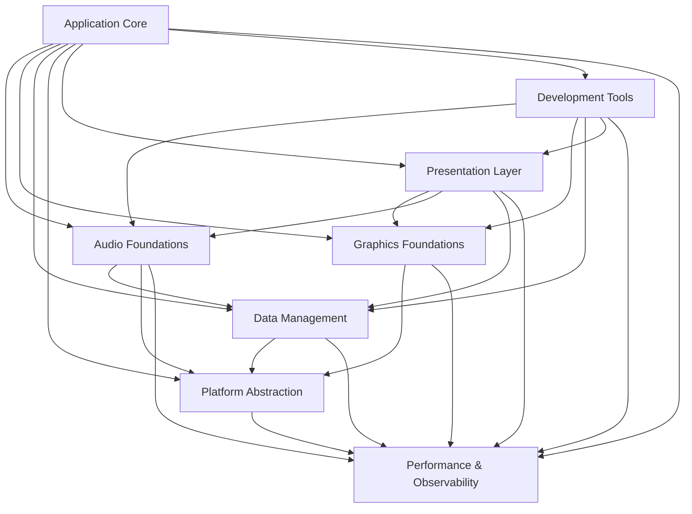

# Pitch-Toy Modular Architecture Restructure

## Introduction

This document outlines the architectural approach for restructuring the Pitch-Toy audio detection application into clearly defined, loosely coupled modules. Its primary goal is to serve as the guiding architectural blueprint for transitioning from the current monolithic structure to a modular system that enables better maintainability, testability, and scalability.

**Relationship to Existing Architecture:**
This document supplements existing project architecture by defining how to refactor current components into distinct modules with clear APIs and boundaries. Where conflicts arise between new modular patterns and existing code, this document provides guidance on maintaining functionality while implementing the restructure.

### Existing Project Analysis

**Current Project State:**

- **Primary Purpose:** Real-time audio pitch detection with immersive visualization for web browsers
- **Current Tech Stack:** Rust/WebAssembly with Yew framework, Web Audio API, HTML/CSS frontend
- **Architecture Style:** Component-based frontend with mixed service/component patterns
- **Deployment Method:** Static web application served via trunk dev server

**Available Documentation:**

- Unified project structure documentation at `docs/system/architecture/unified-project-structure.md`
- Technology stack specifications at `docs/system/architecture/tech-stack.md`
- Testing strategy documentation at `docs/system/architecture/testing-strategy.md`
- Comprehensive story documentation in `docs/production/stories/`

**Identified Constraints:**

- Must maintain Web Audio API compatibility across browsers
- Real-time performance requirements for audio processing
- WebAssembly compilation requirements for Rust code
- Existing Yew component architecture patterns must be preserved
- Debug tooling must be conditionally compiled for development builds

### Change Log

| Change | Date | Version | Description | Author |
| ------ | ---- | ------- | ----------- | ------ |
| Initial | 2025-06-24 | 1.0 | Initial modular architecture design | Winston (Architect) |

## Enhancement Scope and Integration Strategy

### Enhancement Overview

**Enhancement Type:** Architectural Refactoring
**Scope:** Complete modularization of existing codebase into 8 distinct modules
**Integration Impact:** High - affects all existing components and services

### Integration Approach

**Code Integration Strategy:** Gradual refactoring with module-by-module migration maintaining functionality
**Database Integration:** N/A - Client-side only application
**API Integration:** Module-to-module communication via defined interfaces and event system
**UI Integration:** Presentation layer will coordinate between HTML components and OpenGL rendering

### Compatibility Requirements

- **Existing API Compatibility:** All existing component interfaces must be preserved during transition
- **Performance Impact:** No degradation in real-time audio processing performance
- **UI/UX Consistency:** Existing user interface must remain functional throughout refactoring
- **Browser Compatibility:** Maintain support for Chrome, Firefox, Safari, Edge (latest versions)

## Tech Stack Alignment

### Existing Technology Stack

| Category           | Current Technology | Version | Usage in Enhancement | Notes |
| :----------------- | :----------------- | :------ | :------------------- | :---- |
| **Language**       | Rust               | 1.70+   | Core implementation  | Primary language for all modules |
| **Runtime**        | WebAssembly        | Current | Browser execution    | Compilation target for modules |
| **Framework**      | Yew                | 0.21    | Frontend components  | Maintained for Presentation Layer |
| **Audio API**      | Web Audio API      | Current | Audio processing     | Core dependency for Audio Foundations |
| **Graphics**       | WebGL              | 2.0     | Future visualization | To be implemented in Graphics Foundations |
| **Build Tool**     | Trunk              | Current | Development & build  | Maintained for hot reload and WASM compilation |
| **Testing**        | Cargo + Jest       | Current | Unit & integration   | Extended for module testing |

### New Technology Additions

| Technology | Version | Purpose | Rationale | Integration Method |
| :--------- | :------ | :------ | :-------- | :----------------- |
| Event Bus Pattern | Custom | Inter-module communication | Decoupled module coordination | Rust trait-based system |
| Feature Flags | Custom | Conditional compilation | Debug module inclusion control | Cargo features |

## Module Architecture Design

### Core Module Definitions

#### 1. Application Core
**Responsibility:** Application lifecycle, module orchestration, dependency injection
**Integration Points:** All other modules register with Application Core

**Key Interfaces:**
- `ModuleRegistry` - Register and discover modules
- `ApplicationLifecycle` - Startup, shutdown, configuration management
- `EventBus` - Central communication hub

**Dependencies:**
- **Existing Components:** None (foundational)
- **New Components:** All modules depend on this

#### 2. Audio Foundations
**Responsibility:** Audio device management, pitch detection, signal processing
**Integration Points:** Web Audio API, Application Core event system

**Key Interfaces:**
- `AudioEngine` - Core audio processing coordination
- `DeviceManager` - Input/output device handling
- `PitchDetector` - Real-time pitch analysis
- `SignalGenerator` - Test signal creation

**Dependencies:**
- **Existing Components:** Current audio engine, pitch detector
- **New Components:** Application Core

#### 3. Graphics Foundations
**Responsibility:** WebGL setup, shader management, rendering utilities
**Integration Points:** HTML Canvas elements, Performance Monitor

**Key Interfaces:**
- `WebGLContext` - Graphics context management
- `ShaderManager` - Shader compilation and caching
- `RenderPipeline` - Core rendering coordination

**Dependencies:**
- **Existing Components:** None (new module)
- **New Components:** Application Core, Performance Monitor

#### 4. Data Management
**Responsibility:** Audio data flow, real-time buffers
**Integration Points:** Audio Foundations, Platform Abstraction

**Key Interfaces:**
- `AudioBuffer` - Real-time audio data management
- `DataFlow` - Inter-module data coordination

**Dependencies:**
- **Existing Components:** Current audio types
- **New Components:** Audio Foundations, Platform Abstraction

#### 5. Platform Abstraction
**Responsibility:** Browser compatibility, WebAssembly bridges, device capabilities
**Integration Points:** Browser APIs, all modules requiring platform services

**Key Interfaces:**
- `BrowserCompat` - Cross-browser compatibility layer
- `DeviceCapabilities` - Hardware capability detection
- `WasmBridge` - JavaScript interop utilities

**Dependencies:**
- **Existing Components:** Current browser compatibility code
- **New Components:** Application Core

#### 6. Presentation Layer
**Responsibility:** UI coordination between HTML and immersive rendering
**Integration Points:** Yew components, Graphics Foundations, theme system

**Key Interfaces:**
- `UICoordinator` - Cross-platform UI management
- `ThemeManager` - Visual theme system
- `EventHandler` - User interaction coordination

**Dependencies:**
- **Existing Components:** All current Yew components
- **New Components:** Graphics Foundations, Application Core

#### 7. Development Tools
**Responsibility:** Debug interface, performance monitoring, development features
**Integration Points:** All modules via monitoring interfaces

**Key Interfaces:**
- `DebugPanel` - Development-time debugging UI
- `PerformanceMonitor` - Real-time performance tracking
- `FeatureFlags` - Development feature control

**Dependencies:**
- **Existing Components:** Current debug components
- **New Components:** All modules (for monitoring)

#### 8. Performance & Observability
**Responsibility:** Performance monitoring, error tracking, system observability
**Integration Points:** All modules via performance measurement interfaces

**Key Interfaces:**
- `PerformanceTracker` - System-wide performance monitoring
- `ErrorReporter` - Centralized error handling
- `MetricsCollector` - Performance metrics aggregation

**Dependencies:**
- **Existing Components:** Current performance monitoring
- **New Components:** All modules

### Module Interaction Diagram



## Source Tree Integration

### Existing Project Structure

```plaintext
pitch-toy/
├── src/
│   ├── components/         # Yew components
│   ├── services/           # Business logic services
│   ├── audio/              # Audio processing
│   ├── hooks/              # Yew hooks
│   └── types/              # Shared types
├── docs/                   # Documentation
└── tests/                  # Test suites
```

### New Modular File Organization

```plaintext
pitch-toy/
├── src/
│   ├── modules/                    # New modular structure
│   │   ├── application_core/       # Application lifecycle & orchestration
│   │   │   ├── mod.rs
│   │   │   ├── module_registry.rs
│   │   │   ├── lifecycle.rs
│   │   │   └── event_bus.rs
│   │   ├── audio_foundations/      # Audio processing & device management
│   │   │   ├── mod.rs
│   │   │   ├── engine.rs           # Existing audio/engine.rs
│   │   │   ├── pitch_detector.rs   # Existing audio/pitch_detector.rs
│   │   │   ├── device_manager.rs
│   │   │   └── signal_generator.rs
│   │   ├── graphics_foundations/   # WebGL & rendering (new)
│   │   │   ├── mod.rs
│   │   │   ├── webgl_context.rs
│   │   │   ├── shader_manager.rs
│   │   │   └── render_pipeline.rs
│   │   ├── data_management/        # Data flow & buffers
│   │   │   ├── mod.rs
│   │   │   ├── audio_buffer.rs
│   │   │   └── data_flow.rs
│   │   ├── platform_abstraction/   # Browser compatibility
│   │   │   ├── mod.rs
│   │   │   ├── browser_compat.rs   # Existing browser_compat.rs
│   │   │   ├── device_capabilities.rs
│   │   │   └── wasm_bridge.rs
│   │   ├── presentation_layer/     # UI coordination
│   │   │   ├── mod.rs
│   │   │   ├── ui_coordinator.rs
│   │   │   ├── theme_manager.rs
│   │   │   └── components/         # Existing components/ moved here
│   │   ├── development_tools/      # Debug interface (conditional)
│   │   │   ├── mod.rs
│   │   │   ├── debug_panel.rs      # Existing components/debug_panel.rs
│   │   │   ├── performance_monitor.rs
│   │   │   └── feature_flags.rs
│   │   └── performance_observability/ # Monitoring & error handling
│   │       ├── mod.rs
│   │       ├── performance_tracker.rs
│   │       ├── error_reporter.rs   # Existing error_manager.rs
│   │       └── metrics_collector.rs
│   ├── lib.rs                      # Module registration & exports
│   └── main.rs                     # Application bootstrap
├── docs/
│   └── architecture/
│       └── modular-restructure-architecture.md  # This document
└── tests/
    └── integration/                # Module integration tests
        ├── audio_foundations_tests.rs
        ├── graphics_foundations_tests.rs
        └── module_communication_tests.rs
```

### Integration Guidelines

- **File Naming:** Snake_case following existing Rust conventions
- **Folder Organization:** Module-first organization with clear boundaries
- **Import/Export Patterns:** Each module exposes public interface through mod.rs

## Testing Strategy

### Integration with Existing Tests

**Existing Test Framework:** Cargo for unit tests, Jest for WASM integration tests
**Test Organization:** Tests alongside modules with integration tests in /tests
**Coverage Requirements:** Maintain 80% coverage requirement per existing standards

### New Testing Requirements

#### Unit Tests for New Modules

- **Framework:** Cargo test with module-specific test files
- **Location:** Each module contains #[cfg(test)] mod tests
- **Coverage Target:** 80% minimum per existing standards
- **Integration with Existing:** Extend existing test suite structure

#### Module Integration Tests

- **Scope:** Test module-to-module communication and interfaces
- **Module Boundary Testing:** Verify module isolation and API contracts
- **Event System Testing:** Validate inter-module event communication

#### Performance Regression Testing

- **Audio Performance:** Ensure no latency degradation during refactoring
- **Memory Usage:** Monitor WebAssembly memory usage across modules
- **Load Time:** Track application startup performance

## Migration Strategy

### Phase 1: Foundation Setup (Week 1-2)
1. Create Application Core module structure
2. Implement basic module registry and event bus
3. Migrate existing error handling to Performance & Observability module
4. Establish testing patterns for new architecture

### Phase 2: Audio Module Migration (Week 3-4)
1. Migrate existing audio engine to Audio Foundations module
2. Refactor pitch detection into module interface
3. Implement device management within module boundary
4. Test audio performance to ensure no regression

### Phase 3: Platform & Data Modules (Week 5)
1. Move browser compatibility code to Platform Abstraction
2. Create Data Management module for audio buffers
3. Integrate with existing audio processing pipeline

### Phase 4: Presentation Layer Restructure (Week 6-7)
1. Migrate existing Yew components to Presentation Layer module
2. Implement UI coordinator for cross-platform interfaces
3. Create theme management system
4. Prepare Graphics Foundations module structure

### Phase 5: Development Tools & Final Integration (Week 8)
1. Conditionally compile Development Tools module
2. Implement feature flag system for debug features
3. Complete Performance & Observability integration
4. Final testing and documentation updates

## Risk Assessment and Mitigation

### Technical Risks

**Risk:** Performance degradation during modular refactoring
**Impact:** High - Could affect real-time audio processing
**Likelihood:** Medium
**Mitigation:** Implement performance benchmarks before refactoring, test each module migration against baseline

**Risk:** Module interface complexity leading to over-engineering
**Impact:** Medium - Could slow development and increase maintenance
**Likelihood:** Medium  
**Mitigation:** Start with simple interfaces, iterate based on actual usage patterns, follow YAGNI principle

**Risk:** Event bus becoming bottleneck for inter-module communication
**Impact:** High - Could affect application responsiveness
**Likelihood:** Low
**Mitigation:** Design async event system, implement performance monitoring, have direct interface fallback

### Operational Risks

**Risk:** Breaking existing functionality during migration
**Impact:** High - Loss of current working features
**Likelihood:** Medium
**Mitigation:** Incremental migration with continuous testing, feature flags for rollback capability

**Risk:** Increased build complexity affecting development workflow  
**Impact:** Medium - Slower developer iteration
**Likelihood:** Low
**Mitigation:** Maintain trunk hot-reload capability, document module development patterns

## Success Criteria

### Technical Success Metrics
- [ ] All existing functionality preserved post-migration
- [ ] Audio processing latency maintains <10ms requirement
- [ ] Module interfaces clearly defined and documented
- [ ] 80%+ test coverage maintained across all modules
- [ ] Debug features conditionally compiled for production builds

### Architectural Success Metrics
- [ ] Clear separation of concerns between modules
- [ ] Modules can be tested in isolation
- [ ] New feature development simplified by modular boundaries
- [ ] Graphics Foundations module ready for immersive visualization implementation
- [ ] Development Tools module enhances debugging capabilities

This architecture provides the foundation for evolving Pitch-Toy into a more maintainable, scalable, and feature-rich audio visualization application while preserving all existing functionality and performance characteristics. 
