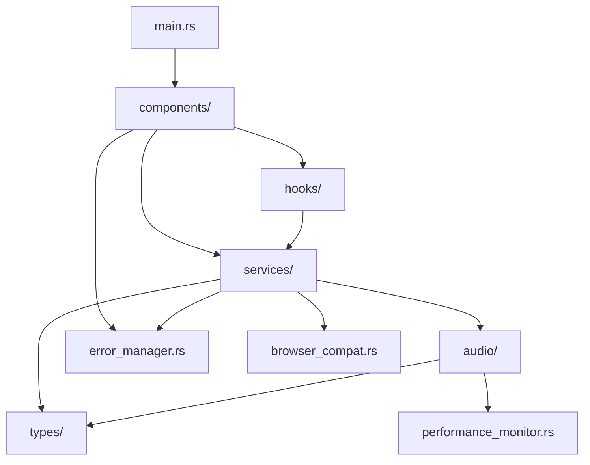

# Source Tree Architecture

## Overview

This document describes the source code organization of the Pitch-Toy application, explaining the purpose and relationships between different modules, files, and architectural layers.

## Root Directory Structure

```
pitch-toy/
├── src/                     # Main application source code
├── docs/                    # Project documentation
├── tests/                   # Integration and manual testing
├── target/                  # Rust build artifacts
├── dist/                    # Trunk build output
├── static/                  # Static web assets
├── .cursor/                 # Development environment rules
├── .ai/                     # AI development artifacts
├── .bmad-core/             # BMAD methodology resources
├── Cargo.toml              # Rust project configuration
├── Cargo.lock              # Dependency lock file
├── index.html              # Application entry point
├── serve.sh                # Development server script
├── build.sh                # Build script
├── CLAUDE.md               # AI assistant instructions
└── README.md               # Project overview
```

## Source Code Architecture (`src/`)

### Module Hierarchy

```
src/
├── main.rs                 # Application entry point
├── lib.rs                  # WASM library exports
├── audio/                  # Audio processing core
├── components/             # Yew UI components
├── services/               # Business logic services
├── hooks/                  # Custom Yew hooks
├── types/                  # Shared type definitions
├── browser_compat.rs       # Browser compatibility layer
├── error_manager.rs        # Global error management
└── performance_monitor.rs  # System performance tracking
```

### Dependency Flow



## Core Modules

### Application Entry (`main.rs`)

**Purpose**: Application bootstrap and root component  
**Responsibilities**:
- Initialize Yew renderer
- Set up global state (AudioEngine, ErrorManager)
- Mount root component hierarchy

```rust
#[function_component(App)]
fn app() -> Html {
    let audio_engine = use_state(|| Some(Rc::new(RefCell::new(AudioEngineService::new()))));
    let error_manager = use_state(|| Some(Rc::new(RefCell::new(ErrorManager::new()))));
    
    html! {
        <div class="app">
            <DebugInterface 
                audio_engine={(*audio_engine).clone()}
                error_manager={(*error_manager).clone()}
            />
        </div>
    }
}
```

### WASM Library (`lib.rs`)

**Purpose**: WebAssembly module exports and coordination  
**Responsibilities**:
- Export public APIs to JavaScript
- Coordinate between Rust modules
- Handle WASM-specific initialization

## Audio Processing Layer (`src/audio/`)

### Module Organization

```
audio/
├── mod.rs                      # Module exports and re-exports
├── engine.rs                   # Core audio engine
├── pitch_detector.rs           # Pitch detection algorithms
├── realtime_processor.rs       # Real-time audio processing
├── signal_analyzer.rs          # Signal analysis utilities
├── performance_monitor.rs      # Audio performance tracking
├── performance_bench.rs        # Performance benchmarking
├── educational_validator.rs    # Validation and testing
├── stress_tester.rs           # Audio stress testing
└── test_reporter.rs           # Test result reporting
```

### Key Components

#### AudioEngine (`engine.rs`)
**Purpose**: Central audio processing coordinator  
**Responsibilities**:
- Manage audio context lifecycle
- Coordinate between pitch detection and UI
- Handle audio stream management
- Error recovery and fallback strategies

#### PitchDetector (`pitch_detector.rs`)
**Purpose**: Pitch detection algorithm implementation  
**Algorithms**:
- YIN Algorithm (primary)
- McLeod Pitch Method (alternative)
- Custom tuning and calibration

#### RealtimeProcessor (`realtime_processor.rs`)
**Purpose**: Low-latency audio processing pipeline  
**Features**:
- AudioWorklet integration
- Buffer management
- Performance optimization
- Memory-efficient processing

#### SignalAnalyzer (`signal_analyzer.rs`)
**Purpose**: Audio signal analysis and preprocessing  
**Capabilities**:
- FFT analysis
- Windowing functions
- Noise reduction
- Signal conditioning

### Audio Module Dependencies

```rust
// Clean API surface via re-exports
pub use engine::AudioEngine;
pub use pitch_detector::PitchDetector;
pub use realtime_processor::{RealtimeProcessor, RealtimeProcessingResult};
pub use signal_analyzer::{SignalAnalyzer, AudioAnalysis};
pub use performance_monitor::{PerformanceMonitor, PerformanceMetrics};
```

## UI Layer (`src/components/`)

### Component Architecture

```
components/
├── mod.rs                    # Component exports
├── debug_interface.rs        # Main debug interface
├── debug_panel.rs           # Debug information panel
├── audio_control_panel.rs   # Audio controls
├── audio_engine.rs          # Audio engine component
├── performance_monitor.rs   # Performance display
├── metrics_display.rs       # Metrics visualization
├── test_signal_generator.rs # Test signal controls
├── microphone_panel.rs      # Microphone management
├── microphone_permission.rs # Permission handling
├── error_display.rs         # Error presentation
├── error_toast.rs           # Toast notifications
└── fallback_ui.rs           # Fallback interfaces
```

### Component Hierarchy

```
App
└── DebugInterface
    ├── AudioControlPanel
    │   ├── MicrophonePanel
    │   └── TestSignalGenerator
    ├── DebugPanel
    │   ├── MetricsDisplay
    │   └── PerformanceMonitor
    ├── ErrorDisplay
    └── ErrorToastContainer
        └── ErrorToast[]
```

### Component Patterns

#### Container Components
- Manage state and business logic
- Handle service integration
- Pass data to presenter components

#### Presenter Components
- Focus on rendering and user interaction
- Receive data via props
- Emit events via callbacks

#### Shared Components
- Reusable across different contexts
- Configurable via props
- Self-contained functionality

## Business Logic Layer (`src/services/`)

### Service Architecture

```
services/
├── mod.rs                  # Service exports
├── audio_engine.rs         # Audio engine service
└── error_manager.rs        # Error management service
```

### Service Responsibilities

#### AudioEngineService (`audio_engine.rs`)
**Purpose**: Audio processing business logic  
**Responsibilities**:
- Audio context management
- Processing pipeline coordination
- State management
- Performance monitoring integration

#### ErrorManager (`error_manager.rs`)
**Purpose**: Centralized error handling  
**Features**:
- Error categorization and prioritization
- User-friendly error messages
- Recovery strategy suggestions
- Error logging and reporting

### Service Integration Pattern

```rust
// Services are shared via Rc<RefCell<T>> pattern
type SharedAudioEngine = Rc<RefCell<AudioEngineService>>;
type SharedErrorManager = Rc<RefCell<ErrorManager>>;

// Components receive services as props
#[derive(Properties, PartialEq)]
pub struct ComponentProps {
    pub audio_engine: Option<SharedAudioEngine>,
    pub error_manager: Option<SharedErrorManager>,
}
```

## Shared Logic Layer (`src/hooks/`)

### Custom Hooks

```
hooks/
├── mod.rs                      # Hook exports
├── use_error_handler.rs        # Error handling hook
└── use_microphone_permission.rs # Permission management hook
```

### Hook Patterns

#### State Management Hooks
- Encapsulate complex state logic
- Provide consistent interfaces
- Handle side effects and cleanup

#### Integration Hooks
- Bridge services and components
- Manage async operations
- Handle browser API integration

## Type System (`src/types/`)

### Type Organization

```
types/
├── mod.rs           # Type exports
└── audio.rs         # Audio-related types
```

### Shared Types

#### Audio Types (`audio.rs`)
**Purpose**: Audio processing type definitions  
**Types**:
- Audio buffer formats
- Processing parameters
- Configuration structures
- Error types

### Type Design Principles

- **Explicit Over Implicit**: Clear type definitions
- **Validation**: Built-in validation logic
- **Serialization**: Serde support for persistence
- **Documentation**: Comprehensive type documentation

## Cross-Cutting Concerns

### Error Management (`error_manager.rs`)

**Architecture**: Centralized error handling service  
**Integration**: Used across all modules  
**Features**:
- Error categorization
- User-friendly messaging
- Recovery suggestions
- Logging and metrics

### Performance Monitoring (`performance_monitor.rs`)

**Architecture**: System-wide performance tracking  
**Integration**: Embedded throughout audio pipeline  
**Metrics**:
- Audio processing latency
- Memory usage
- CPU utilization
- Error rates

### Browser Compatibility (`browser_compat.rs`)

**Architecture**: Compatibility abstraction layer  
**Purpose**: Handle browser differences  
**Features**:
- Feature detection
- Polyfills and workarounds
- Graceful degradation
- Error messaging for unsupported browsers

## Build and Configuration

### Cargo Configuration (`Cargo.toml`)

**Sections**:
- Package metadata
- Library configuration
- Binary configuration
- Dependencies with feature flags
- Build profiles (dev/release)
- Feature flag definitions

### Feature Flag Architecture

```toml
[features]
# Core feature sets
default = ["basic-features"]
basic-features = ["audio-processing", "pitch-detection"]
full-features = ["basic-features", "debug-features", "advanced-features"]

# Development features
debug-features = ["debug-logging", "performance-profiling", "memory-debugging"]

# Advanced features
advanced-features = ["enhanced-validation", "stress-testing"]
```

**Usage Pattern**: Conditional compilation based on target environment

## Documentation Structure (`docs/`)

### Architecture Documentation

```
docs/
├── architecture/
│   ├── coding-standards.md     # This file
│   ├── tech-stack.md          # Technology choices
│   └── source-tree.md         # This document
├── system/
│   └── architecture/          # System architecture docs
└── production/
    └── stories/               # Development stories
```

## Testing Architecture

### Test Organization

```
tests/
├── integration/               # Integration tests
├── manual-testing/           # Manual test procedures
└── performance/              # Performance benchmarks
```

### Testing Strategy

- **Unit Tests**: Embedded in source modules (`#[cfg(test)]`)
- **Integration Tests**: Cross-module functionality testing
- **Manual Tests**: Browser compatibility and user experience
- **Performance Tests**: Automated benchmarking

## Development Tools

### Development Scripts

- `serve.sh`: Development server with hot reload
- `build.sh`: Production build script
- Custom Trunk configuration for WASM builds

### AI Development Support

- `CLAUDE.md`: AI assistant project instructions
- `.cursor/`: Development environment rules
- `.ai/`: AI development artifacts
- `.bmad-core/`: BMAD methodology resources

## Module Interaction Patterns

### Service Injection Pattern

```rust
// Services injected at app level
let audio_engine = use_state(|| Some(Rc::new(RefCell::new(AudioEngineService::new()))));

// Passed down through component hierarchy
<DebugInterface audio_engine={(*audio_engine).clone()} />
```

### Error Propagation Pattern

```rust
// Errors bubble up through Result types
match audio_engine.borrow_mut().start_processing() {
    Ok(result) => handle_success(result),
    Err(error) => error_manager.borrow_mut().handle_error(error),
}
```

### State Management Pattern

```rust
// Centralized state with local subscriptions
let audio_state = use_state(|| AudioState::default());

// State updates trigger component re-renders
let on_audio_change = {
    let audio_state = audio_state.clone();
    Callback::from(move |new_state| {
        audio_state.set(new_state);
    })
};
```

## Performance Considerations

### Hot Path Optimization
- Audio processing modules optimized for minimal allocations
- Efficient buffer management in `realtime_processor.rs`
- Performance monitoring throughout audio pipeline

### Memory Management
- `Rc<RefCell<T>>` for shared state without garbage collection overhead
- Careful WASM memory allocation strategies
- Audio buffer reuse patterns

### Build Optimization
- Separate dev/release profiles
- Feature flags for conditional compilation
- Link-time optimization for release builds

## Conclusion

This source tree architecture provides:

✅ **Clear Separation of Concerns**: Each module has well-defined responsibilities  
✅ **Scalable Organization**: Structure supports growth and refactoring  
✅ **Maintainable Dependencies**: Clear dependency flow and minimal coupling  
✅ **Performance Focus**: Architecture optimized for real-time audio processing  
✅ **Development Experience**: Logical organization supports efficient development  
✅ **Testing Strategy**: Structure supports comprehensive testing approaches  

The architecture balances immediate development needs with long-term maintainability and performance requirements.