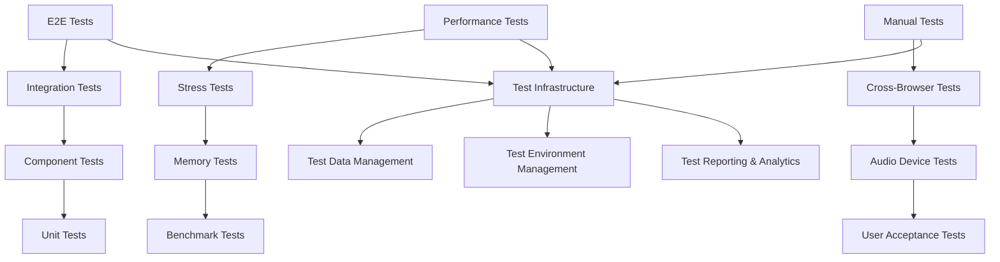

# Testing Strategy & Standards

## Introduction

This document outlines the comprehensive testing strategy for the Pitch-Toy real-time audio pitch detection application. Our testing approach addresses the unique challenges of WebAssembly deployment, real-time audio processing, cross-browser compatibility, and modular architecture.

The strategy balances thorough quality assurance with development velocity, ensuring reliable audio performance while maintaining rapid iteration cycles for AI-driven development.

## Testing Philosophy

### Core Principles

- **Performance-First Testing**: All tests must respect real-time audio constraints (<10ms latency)
- **Cross-Stack Validation**: Test from Rust core through WebAssembly to browser APIs
- **Automated Quality Gates**: Prevent performance regressions through continuous benchmarking
- **Pragmatic Coverage**: Focus testing effort on critical audio processing paths
- **Developer Experience**: Fast feedback loops with clear failure diagnosis

### Quality Targets

| Metric | Target | Critical Threshold |
|--------|--------|--------------------|
| **Unit Test Coverage** | 90% | 80% minimum |
| **Integration Test Coverage** | 85% | 75% minimum |
| **Performance Regression** | 0% | 10% maximum |
| **Cross-Browser Compatibility** | 100% core features | 95% minimum |
| **Audio Processing Latency** | <10ms | <15ms maximum |
| **Test Suite Execution Time** | <30 seconds | <60 seconds maximum |

## Testing Architecture

### Testing Stack Overview



### Test Infrastructure Components

- **Core Testing Framework**: Native Rust `#[cfg(test)]` with custom test infrastructure
- **WebAssembly Testing**: `wasm-bindgen-test` for browser environment validation
- **Performance Testing**: Custom stress testing framework and benchmark suite
- **Integration Testing**: Comprehensive module interaction validation
- **Cross-Browser Testing**: Manual and automated browser compatibility validation

## Testing Layers

### 1. Unit Tests

**Location**: `#[cfg(test)]` modules next to implementation  
**Framework**: Native Rust testing with custom helpers  
**Coverage Target**: 90%  
**Execution Time**: <5 seconds

#### Test Categories

**Audio Processing Core** (`src/audio/` and `src/modules/audio_foundations/`)
```rust
// Example unit test structure
#[cfg(test)]
mod tests {
    use super::*;
    
    #[test]
    fn test_pitch_detection_accuracy() {
        let detector = MultiAlgorithmPitchDetector::new(config, None).unwrap();
        let test_signal = generate_sine_wave(440.0, 44100.0, 1024, 0.5);
        let result = detector.detect_pitch(&test_signal).unwrap();
        assert_frequency_within_tolerance(result.frequency, 440.0, 0.1);
    }
}
```

**Key Unit Test Requirements**:
- Signal generation and analysis accuracy
- Algorithm configuration validation
- Memory management and cleanup
- Error handling and recovery
- Performance threshold validation

**Application Core Modules** (`src/modules/application_core/`)
- Event bus functionality and type safety
- Module registry and lifecycle management
- Configuration coordination and validation
- Dependency injection container behavior
- Buffer reference management

### 2. Integration Tests

**Location**: `src/modules/*/integration_*.rs`  
**Framework**: Custom integration test infrastructure  
**Coverage Target**: 85%  
**Execution Time**: <10 seconds

#### Cross-Module Integration

**Audio Foundations ↔ Application Core**
```rust
#[test]
fn test_audio_event_publishing_integration() {
    let event_bus = TypedEventBus::new();
    let audio_module = AudioFoundationsModule::new(Arc::new(event_bus));
    
    // Test real-time event publishing
    audio_module.publish_pitch_detected(PitchResult { /* ... */ });
    
    // Verify event received with <1ms latency
    assert_event_latency_under_1ms();
}
```

**Device Management ↔ Audio Processing**
- Device enumeration and selection flow
- Permission handling across browser contexts
- Audio stream initialization and teardown
- Error recovery during device changes

**Performance Monitoring ↔ All Modules**
- Real-time metrics collection accuracy
- Performance threshold alert system
- Historical data retention and analysis
- Regression detection validation

### 3. Component Tests (WebAssembly Layer)

**Location**: `tests/wasm/`  
**Framework**: `wasm-bindgen-test`  
**Target**: Browser environment validation  
**Execution Time**: <15 seconds

#### WebAssembly Integration Testing

**WASM ↔ JavaScript Interop**
```rust
#[wasm_bindgen_test]
fn test_audio_worklet_integration() {
    let audio_engine = AudioEngine::new();
    let worklet_result = audio_engine.process_audio_worklet(&test_buffer);
    assert!(worklet_result.is_ok());
    assert_latency_under_10ms(worklet_result.processing_time);
}
```

**Web Audio API Integration**
- AudioContext lifecycle management
- AudioWorklet processor communication
- Real-time audio buffer processing
- Performance constraint validation

### 4. Performance & Stress Tests

**Location**: `src/modules/*/stress_*.rs`, `src/audio/stress_tester.rs`  
**Framework**: Custom stress testing framework  
**Target**: Performance regression prevention  
**Execution Time**: <30 seconds

#### Performance Test Categories

**Audio Processing Performance**
```rust
#[test]
fn test_sustained_pitch_detection_performance() {
    let config = StressTestConfig {
        cycles: 10000,
        target_latency_ms: 10.0,
        // ...
    };
    let result = StressTester::run_sustained_load_test(config);
    assert!(result.average_latency_ms < 10.0);
    assert!(!result.performance_degradation_detected);
}
```

**Event Bus Throughput**
- 1000+ events/second sustained processing
- Priority queue performance under load
- Memory usage during high-throughput scenarios
- Latency distribution analysis

**Memory Leak Detection**
- Long-running session memory monitoring
- Reference counting validation
- WebAssembly memory management
- Browser memory pressure testing

### 5. Cross-Browser Compatibility Tests

**Location**: `tests/manual-testing/`  
**Framework**: Manual testing with automated verification scripts  
**Target**: Chrome, Firefox, Safari, Edge  
**Execution**: Pre-release validation

#### Browser-Specific Test Matrix

| Feature | Chrome | Firefox | Safari | Edge |
|---------|---------|---------|--------|------|
| **getUserMedia** | ✅ | ✅ | ✅ | ✅ |
| **AudioWorklet** | ✅ | ✅ | ⚠️ | ✅ |
| **WebAssembly** | ✅ | ✅ | ✅ | ✅ |
| **Performance** | ✅ | ✅ | ⚠️ | ✅ |

**Manual Test Scenarios**:
- Microphone permission flow in each browser
- Audio device enumeration and selection
- Real-time pitch detection accuracy
- Performance under different hardware configurations
- Error recovery and fallback behavior

### 6. End-to-End (E2E) Tests

**Location**: `tests/e2e/`  
**Framework**: Browser automation (future implementation)  
**Target**: Complete user workflows  
**Execution**: Release validation

#### E2E Test Scenarios

**Complete Audio Pipeline**
1. User grants microphone permission
2. Application detects available audio devices
3. User selects input device
4. Real-time pitch detection starts
5. Visualizations update in real-time
6. Performance monitoring active
7. Error recovery tested

**Educational Features**
1. Test signal generation and analysis
2. Musical interval detection accuracy
3. Learning progress tracking
4. Practice session statistics

## Test Data Management

### Signal Generation for Testing

**Test Signal Library** (`src/modules/audio_foundations/test_signal_library.rs`)
```rust
pub struct TestSignalLibrary {
    // Predefined test signals for consistent testing
    musical_notes: HashMap<String, Vec<f32>>,
    noise_samples: Vec<f32>,
    frequency_sweeps: Vec<f32>,
}
```

**Test Signal Categories**:
- **Pure Tones**: Precise frequency validation (A4 = 440Hz, etc.)
- **Musical Intervals**: Harmonic relationship testing
- **Complex Signals**: Real-world instrument simulation
- **Noise Samples**: Algorithm robustness testing
- **Edge Cases**: Boundary condition validation

### Mock Audio Infrastructure

**Mock Audio Devices** (Feature Flag: `mock-audio`)
```rust
#[cfg(feature = "mock-audio")]
pub struct MockAudioDevice {
    pub device_id: String,
    pub sample_rate: u32,
    pub signal_generator: TestSignalGenerator,
}
```

## Test Execution Strategy

### Development Workflow Integration

**Pre-Commit Hooks**
```bash
#!/bin/bash
# Run fast unit tests before commit
cargo test --lib --bins
cargo test --package pitch-toy --features test-features
```

**Continuous Integration Pipeline**
```yaml
# Example CI configuration
test_suite:
  - unit_tests: cargo test --all-features
  - integration_tests: cargo test --test integration
  - wasm_tests: wasm-pack test --chrome --firefox
  - performance_tests: cargo test --release --features stress-testing
  - coverage_report: cargo tarpaulin --out html
```

### Test Environment Management

**Feature Flag Strategy**
```toml
[features]
test-features = ["mock-audio", "automated-testing"]
mock-audio = []  # Enable mock audio devices for testing
automated-testing = []  # Enable test automation helpers
stress-testing = []  # Enable stress testing framework
```

**Environment Configuration**
- **Development**: Full test suite with mock devices
- **CI/CD**: Automated tests with performance validation
- **Release**: Cross-browser manual validation
- **Production**: Real-time monitoring and error reporting

## Performance Testing Standards

### Latency Requirements

| Component | Target Latency | Maximum Acceptable |
|-----------|----------------|-------------------|
| **Pitch Detection** | <5ms | <10ms |
| **Event Publishing** | <1ms (critical) | <5ms |
| **UI Updates** | <16ms (60fps) | <33ms (30fps) |
| **Device Switching** | <500ms | <1000ms |

### Throughput Requirements

| Component | Target Throughput | Minimum Acceptable |
|-----------|-------------------|-------------------|
| **Event Bus** | 1000+ events/sec | 500 events/sec |
| **Audio Processing** | 44.1kHz sustained | 22kHz minimum |
| **Test Suite** | <30s execution | <60s maximum |

### Memory Requirements

| Component | Target Usage | Maximum Acceptable |
|-----------|--------------|-------------------|
| **Audio Buffers** | <10MB | <50MB |
| **Event Bus** | <5MB | <25MB |
| **Test Data** | <20MB | <100MB |

## Error Handling & Recovery Testing

### Error Scenario Testing

**Device Error Scenarios**
- Microphone disconnection during recording
- Permission revoked by user
- Audio device driver failure
- System audio service interruption

**Performance Error Scenarios**
- CPU overload simulation
- Memory pressure testing
- Network latency impact
- Browser tab backgrounding

**Recovery Validation**
```rust
#[test]
fn test_graceful_recovery_from_device_failure() {
    let recovery_manager = GracefulRecoveryManager::new();
    
    // Simulate device failure
    let failure_result = recovery_manager.handle_device_failure("device_001");
    
    // Verify graceful fallback
    assert!(failure_result.fallback_device.is_some());
    assert_eq!(failure_result.quality_impact, QualityImpact::Minimal);
}
```

## Test Reporting & Analytics

### Test Results Structure

**Comprehensive Test Report**
```rust
pub struct TestExecutionReport {
    pub timestamp: chrono::DateTime<chrono::Utc>,
    pub environment: TestEnvironment,
    pub results: TestResults,
    pub performance_metrics: PerformanceMetrics,
    pub coverage_report: CoverageReport,
    pub regression_analysis: RegressionAnalysis,
}
```

### Continuous Quality Monitoring

**Quality Metrics Dashboard**
- Test success rates over time
- Performance regression tracking
- Code coverage trend analysis
- Cross-browser compatibility status
- Error rate monitoring

**Automated Alerting**
- Performance regression detection
- Test failure notifications
- Coverage decrease alerts
- Browser compatibility issues

## Test Maintenance Strategy

### Test Code Quality Standards

**Test Code Principles**
- Tests should be deterministic and repeatable
- Mock dependencies should accurately represent real behavior
- Performance tests should run in isolated environments
- Test data should be version controlled and documented

**Test Documentation Requirements**
- Each test category has clear documentation
- Complex test scenarios include step-by-step explanation
- Performance benchmarks include baseline establishment
- Error scenarios document expected recovery behavior

### Test Suite Evolution

**Regular Test Review Cycle**
- Monthly test suite performance review
- Quarterly cross-browser validation update
- Annual testing strategy review and updates
- Continuous integration with new feature development

**Test Automation Expansion**
- Gradual automation of manual test scenarios
- Enhanced cross-browser testing infrastructure
- Performance monitoring integration
- Error reporting and analytics improvement

## Conclusion

This testing strategy provides comprehensive coverage for the Pitch-Toy application while respecting the unique constraints of real-time audio processing. The multi-layered approach ensures quality at every level, from individual function accuracy to complete user workflow validation.

The strategy balances thoroughness with practicality, enabling rapid development cycles while maintaining the high-quality standards required for professional audio applications. Regular review and evolution of the testing approach will ensure continued effectiveness as the application grows and evolves.

**Key Success Metrics**:
- Maintain <10ms audio processing latency under all test conditions
- Achieve 90%+ unit test coverage with fast execution times
- Ensure 100% core feature compatibility across target browsers
- Provide clear failure diagnosis and recovery guidance
- Enable confident continuous deployment through automated quality gates

This comprehensive testing foundation supports the application's goal of providing reliable, high-performance real-time audio pitch detection while maintaining exceptional user experience across all supported platforms. 