# Modular Architecture Foundation - Epic Breakdown

**Version:** 1.0  
**Date:** 2025-06-24  
**Author:** Winston (Architect)

## Overview

This document breaks down the foundational modular architecture implementation into **4 core epics** focusing on the essential infrastructure needed before other modules can be developed. These epics establish the communication backbone and core services that all other modules depend on.

**Implementation Priority:** These 4 epics must be completed **sequentially** as each depends on the previous one.

---

## Epic 1: Event Bus Infrastructure 🚌

**Epic ID:** `EPIC-001`  
**Priority:** Critical  
**Dependencies:** None  
**Estimated Effort:** 3-4 weeks  
**Success Criteria:** Reliable inter-module communication with performance guarantees

### Epic Description

Create the central event bus system that enables **type-safe, performant communication** between all modules. This forms the backbone of the entire modular architecture, handling everything from critical real-time audio events to low-priority debug information.

### Key Features
- **Priority-based event routing** (Critical/High/Normal/Low)
- **Type-safe event publishing and subscription**
- **Zero-copy audio buffer sharing**
- **Performance monitoring and latency tracking**
- **Conditional debug event support**

### Technical Requirements
- Support **<1ms latency** for critical audio events
- Handle **1000+ events/second** without performance degradation
- Provide **compile-time type safety** for all event interactions
- Enable **zero-copy** audio data sharing between modules

### Stories in Epic 1
1. Core Event Bus Trait Definition (`STORY-001`)
2. Event Priority Queue Implementation (`STORY-002`)
3. Type-Safe Event Registration System (`STORY-003`)
4. Zero-Copy Buffer Reference Manager (`STORY-004`)
5. Performance Monitoring Integration (`STORY-005`)
6. Event Bus Testing Infrastructure (`STORY-006`)

---

## Epic 2: Application Core Module 🏗️

**Epic ID:** `EPIC-002`  
**Priority:** Critical  
**Dependencies:** Event Bus Infrastructure (EPIC-001)  
**Estimated Effort:** 2-3 weeks  
**Success Criteria:** Complete module lifecycle management and dependency injection

### Epic Description

Implement the **Application Core module** that orchestrates all other modules, manages their lifecycle, and provides dependency injection. This module serves as the foundation that all other modules register with and depend on for coordination.

### Key Features
- **Module registry and discovery**
- **Application lifecycle management** (startup, shutdown, configuration)
- **Dependency injection** for inter-module services
- **Configuration management** coordination
- **Error handling** escalation and recovery

### Technical Requirements
- Support **hot module registration** during development
- Provide **graceful shutdown** with proper cleanup
- Handle **module initialization failures** with recovery
- Enable **module isolation** for testing

### Stories in Epic 2
1. Module Registry Implementation (`STORY-007`)
2. Application Lifecycle Management (`STORY-008`)
3. Dependency Injection Container (`STORY-009`)
4. Module Configuration Coordination (`STORY-010`)
5. Error Recovery and Module Isolation (`STORY-011`)
6. Application Core Testing Suite (`STORY-012`)

---

## Epic 3: Audio Foundations Module 🎵

**Epic ID:** `EPIC-003`  
**Priority:** Critical  
**Dependencies:** Application Core Module (EPIC-002), Event Bus Infrastructure (EPIC-001)  
**Estimated Effort:** 4-5 weeks  
**Success Criteria:** Real-time audio processing with existing performance maintained

### Epic Description

Migrate existing audio functionality into the **Audio Foundations module** while maintaining all current performance characteristics. This module handles microphone access, real-time pitch detection, signal generation, and performance monitoring within the new modular architecture.

### Key Features
- **Real-time audio processing** with <10ms latency
- **Multi-algorithm pitch detection** (YIN, McLeod)
- **Web Audio API device management**
- **Signal generation** for testing and calibration
- **Performance monitoring** and error reporting

### Technical Requirements
- **Zero performance regression** from current implementation
- Support **multiple pitch detection algorithms** with runtime switching
- Provide **comprehensive error handling** for audio failures
- Enable **hot configuration updates** without audio interruption

### Stories in Epic 3
1. Audio Engine Service Migration (`STORY-013`)
2. Device Manager Implementation (`STORY-014`)
3. Multi-Algorithm Pitch Detection (`STORY-015`)
4. Signal Generator Integration (`STORY-016`)
5. Performance Monitoring System (`STORY-017`)
6. Audio Event Publishing Integration (`STORY-018`)
7. Audio Foundations Testing Suite (`STORY-019`)

---

## Epic 4: Platform & Data Modules 🌐

**Epic ID:** `EPIC-004`  
**Priority:** Critical  
**Dependencies:** Audio Foundations Module (EPIC-003), Application Core Module (EPIC-002), Event Bus Infrastructure (EPIC-001)  
**Estimated Effort:** 1 week intensive  
**Success Criteria:** Robust platform abstraction and efficient data management infrastructure

### Epic Description

Create the **Platform Abstraction and Data Management modules** that provide cross-browser compatibility, device capability detection, and efficient data handling infrastructure. These modules complete the foundational architecture needed for presentation and visualization modules.

### Key Features
- **Cross-browser platform abstraction** with performance optimization
- **Enhanced device capability detection** integrated with Audio Foundations
- **Efficient audio buffer management** with pooling and recycling
- **Data flow coordination** between modules

### Technical Requirements
- **Platform detection** <5ms with 99%+ accuracy
- **Buffer allocation** <1ms with 90%+ pool hit rate
- **Data flow** support for 1000+ operations/second

### Stories in Epic 4
1. Platform Abstraction Module Foundation (`STORY-020`)
2. Browser Compatibility Enhancement (`STORY-021`)
3. Device Capability Detection System (`STORY-022`)
4. Data Management Module Foundation (`STORY-023`)
5. Buffer Pool Optimization System (`STORY-024`)
6. Data Flow Coordination System (`STORY-025`)

---

## Epic Dependencies and Timeline

```mermaid
gantt
    title Foundation Epics Timeline
    dateFormat X
    axisFormat %d

    section Epic 1: Event Bus
    Core Event Traits           :done, e1s1, 0, 3d
    Priority Queue System       :done, e1s2, after e1s1, 4d
    Type-Safe Registration      :done, e1s3, after e1s2, 3d
    Zero-Copy Buffer Manager    :done, e1s4, after e1s3, 5d
    Performance Integration     :done, e1s5, after e1s4, 3d
    Testing Infrastructure      :done, e1s6, after e1s5, 4d

    section Epic 2: App Core
    Module Registry             :done, e2s1, after e1s6, 4d
    Lifecycle Management        :done, e2s2, after e2s1, 3d
    Dependency Injection        :done, e2s3, after e2s2, 4d
    Configuration Coordination  :done, e2s4, after e2s3, 3d
    Error Recovery              :done, e2s5, after e2s4, 3d
    Core Testing                :done, e2s6, after e2s5, 3d

    section Epic 3: Audio Module
    Audio Engine Migration      :done, e3s1, after e2s6, 5d
    Device Manager              :done, e3s2, after e3s1, 4d
    Pitch Detection             :done, e3s3, after e3s2, 6d
    Signal Generator            :done, e3s4, after e3s3, 3d
    Performance Monitoring      :done, e3s5, after e3s4, 4d
    Event Integration           :done, e3s6, after e3s5, 3d
    Audio Testing               :done, e3s7, after e3s6, 4d

    section Epic 4: Platform & Data
    Platform Abstraction        :done, e4s1, after e3s7, 1d
    Browser Enhancement         :done, e4s2, after e4s1, 1d
    Device Capabilities         :done, e4s3, after e4s1, 1d
    Data Management             :done, e4s4, after e4s2, 1d
    Buffer Pool Optimization    :done, e4s5, after e4s4, 1d
    Data Flow Coordination      :done, e4s6, after e4s5, 1d
```

**Total Timeline:** ~11-13 weeks for all four foundation epics

---

## Risk Assessment

### High Risk Items
1. **Audio Performance Regression** (Epic 3)
   - *Mitigation:* Comprehensive benchmarking before/after migration
   - *Fallback:* Keep existing audio service as backup during transition

2. **Event Bus Bottlenecks** (Epic 1)
   - *Mitigation:* Early performance testing with realistic loads
   - *Fallback:* Direct module communication bypass for critical paths

3. **Module Initialization Complexity** (Epic 2)
   - *Mitigation:* Simple module interfaces with clear error messages
   - *Fallback:* Staged module loading with manual intervention points

### Medium Risk Items
1. **Zero-Copy Buffer Management Complexity**
2. **Cross-Module Error Propagation**
3. **Development Workflow Disruption**

---

## Success Metrics

### Epic 1 (Event Bus) Success Criteria
- [x] Event dispatch latency <1ms for critical events
- [x] Support 1000+ events/second sustained load
- [x] Zero compilation errors for type-safe event usage
- [x] Memory usage <5MB for event bus infrastructure

### Epic 2 (Application Core) Success Criteria  
- [x] Module registration/deregistration in <100ms
- [x] Graceful shutdown of all modules in <2 seconds
- [x] Configuration changes propagated in <50ms
- [x] 100% module isolation in unit tests

### Epic 3 (Audio Foundations) Success Criteria
- [x] Audio processing latency maintains <10ms requirement
- [x] Pitch detection accuracy ≥95% (same as current)
- [x] No audio dropouts during 1-hour stress test
- [x] All current audio features preserved

### Epic 4 (Platform & Data) Success Criteria  
- [x] Platform detection and optimization working across all supported browsers
- [x] Data management system handling >1000 operations/second with <2ms overhead
- [x] Buffer pool achieving >90% hit rate with <5% memory overhead
- [x] Zero performance regression from Epic 3 baseline
- [x] Complete integration with existing module ecosystem

---

## Next Steps

1. **Review and approve** this epic breakdown
2. **Begin Epic 1** with Story 001 - Core Event Bus Trait Definition
3. **Set up project tracking** for epic and story progress
4. **Establish testing baseline** for performance regression detection

This foundation will enable rapid development of the remaining 5 modules (Graphics, Data Management, Platform Abstraction, Presentation Layer, Development Tools, Performance & Observability) in subsequent phases.