# Theme and Color Scheme Analysis

This document provides a comprehensive analysis of the theme and color scheme system implemented in the intonation-toy application.

## Overview

The application implements a sophisticated theming system that combines Rust-based theme management with CSS custom properties for efficient runtime theme switching. The system is designed around a three-layer architecture with centralized theme state management.

## Architecture Components

### 1. Core Theme Types (`shared_types.rs`)

The theme system is built around two primary types:

#### Theme Enum
```rust
#[derive(Debug, Clone, Copy, PartialEq, Eq, Hash)]
pub enum Theme {
    Dark,
    Light,
    Autumn,
    Sunset,
}
```

**Available Themes:**
- **Dark**: Default theme with soft charcoal background and teal accents
- **Light**: High contrast theme with white backgrounds 
- **Autumn**: Warm color palette with browns and oranges
- **Sunset**: Dramatic theme with deep reds and oranges

#### ColorScheme Struct
```rust
pub struct ColorScheme {
    pub background: [f32; 3],  // Primary background color
    pub surface: [f32; 3],     // UI surface elements (cards, panels)
    pub primary: [f32; 3],     // Primary accent color
    pub secondary: [f32; 3],   // Secondary accent color  
    pub accent: [f32; 3],      // Highlight color
    pub text: [f32; 3],        // Primary text color
    pub muted: [f32; 3],       // Muted/secondary text color
}
```

**Color Specifications:**
- Colors are stored as normalized RGB floats (0.0-1.0)
- Each theme provides a complete color palette through `ColorScheme::dark()`, `::light()`, etc.
- All themes use const functions for compile-time color definitions

### 2. Theme State Management (`theme.rs`)

The theme system uses a global singleton pattern for state management:

```rust
static CURRENT_THEME: OnceLock<Mutex<Theme>> = OnceLock::new();
```

**Key Functions:**
- `initialize_theme(theme: Theme)`: Sets initial theme on app startup
- `get_current_theme() -> Theme`: Retrieves current theme
- `get_current_color_scheme() -> ColorScheme`: Gets current colors
- `set_current_theme(theme: Theme)`: Changes theme at runtime
- `rgb_to_srgba()`: Converts RGB to three_d rendering format

**Thread Safety:**
- Uses `OnceLock` for safe initialization
- `Mutex` provides thread-safe access to theme state
- Global access from any layer of the application

### 3. CSS Integration (`styling.rs`)

The styling system bridges Rust theme management with web CSS:

#### CSS Custom Properties System
```rust
pub fn apply_css_variables() {
    let color_scheme = get_current_color_scheme();
    let css = format!(r#":root {{
        --color-background: {};
        --color-surface: {};
        --color-primary: {};
        --color-secondary: {};
        --color-accent: {};
        --color-text: {};
        --color-muted: {};
    }}"#, ...);
    add_style_to_document(&css);
}
```

#### Runtime Theme Updates
```rust
pub fn update_css_variables() {
    // Direct style manipulation for efficient theme switching
    apply_style_to_element(":root", &style);
}

pub fn reapply_current_theme() {
    update_css_variables(); // Only variables need updating
}
```

**Efficiency Features:**
- CSS custom properties enable instant theme switching
- No need to regenerate all CSS - only update root variables
- All components automatically inherit new colors

#### Component Styling
The system provides comprehensive styling functions:

- `apply_body_styles()`: Main application layout
- `apply_sidebar_styles()`: Navigation and controls
- `apply_canvas_styles()`: Render target styling  
- `apply_control_styles()`: Interactive elements
- `apply_permission_styles()`: Modal overlays
- `apply_status_classes()`: State indicators

**CSS Features:**
- Uses CSS `color-mix()` for dynamic color blending
- Supports backdrop filters and modern CSS features
- Responsive design with flexbox layouts
- Semantic color usage throughout

### 4. Color Conversion Utilities (`web/utils.rs`)

```rust
pub fn rgb_to_css(rgb: [f32; 3]) -> String {
    format!("rgb({}, {}, {})", 
        (rgb[0] * 255.0) as u8, 
        (rgb[1] * 255.0) as u8, 
        (rgb[2] * 255.0) as u8
    )
}

pub fn rgba_to_css(rgb: [f32; 3], alpha: f32) -> String {
    // Similar conversion with alpha channel
}
```

**Conversion Features:**
- Converts normalized RGB (0.0-1.0) to CSS integers (0-255)
- Supports both RGB and RGBA formats
- Used by CSS variable generation system

### 5. Theme Switching (`engine/platform/commands.rs`)

Runtime theme changes are handled through console commands:

```rust
match theme_name {
    "light" => Theme::Light,
    "dark" => Theme::Dark, 
    "autumn" => Theme::Autumn,
    "sunset" => Theme::Sunset,
    _ => return error
}
crate::theme::set_current_theme(new_theme);
```

**Command Interface:**
- Console command: `theme <name>`
- Validates theme names before switching
- Triggers immediate CSS variable updates
- Provides user feedback for invalid themes

## Architecture Diagram

```mermaid
graph TB
    %% Define theme variants
    ThemeDark[Dark Theme]
    ThemeLight[Light Theme]
    ThemeAutumn[Autumn Theme]
    ThemeSunset[Sunset Theme]
    
    %% Core types and state management
    subgraph "Core Types (shared_types.rs)"
        ThemeEnum[Theme Enum<br/>- Dark<br/>- Light<br/>- Autumn<br/>- Sunset]
        ColorScheme[ColorScheme Struct<br/>- background: RGB array<br/>- surface: RGB array<br/>- primary: RGB array<br/>- secondary: RGB array<br/>- accent: RGB array<br/>- text: RGB array<br/>- muted: RGB array]
    end
    
    %% State management layer
    subgraph "State Management (theme.rs)"
        GlobalState[Static CURRENT_THEME<br/>OnceLock Mutex Theme]
        InitTheme[initialize_theme]
        GetTheme[get_current_theme]
        SetTheme[set_current_theme]
        GetColors[get_current_color_scheme]
        RgbConverter[rgb_to_srgba]
    end
    
    %% CSS Integration layer  
    subgraph "CSS Integration (styling.rs)"
        CSSVars[CSS Custom Properties<br/>--color-background<br/>--color-surface<br/>--color-primary<br/>etc.]
        ApplyCSS[apply_css_variables]
        UpdateCSS[update_css_variables]
        ReapplyTheme[reapply_current_theme]
        AddStyle[add_style_to_document]
    end
    
    %% Component styling
    subgraph "Component Styling (styling.rs)"
        BodyStyles[apply_body_styles]
        SidebarStyles[apply_sidebar_styles]
        CanvasStyles[apply_canvas_styles]
        ControlStyles[apply_control_styles]
        StatusStyles[apply_status_classes]
        PermissionStyles[apply_permission_styles]
    end
    
    %% Color conversion utilities
    subgraph "Color Utils (web/utils.rs)"
        RgbToCss[rgb_to_css]
        RgbaToCss[rgba_to_css]
    end
    
    %% Theme switching interface
    subgraph "Theme Switching (platform/commands.rs)"
        Console[Console Command<br/>theme name]
        ValidateTheme[Validate Theme Name]
        TriggerSwitch[Trigger Theme Switch]
    end
    
    %% Application initialization
    subgraph "App Initialization (lib.rs)"
        AppStart[App Startup]
        DefaultTheme[DEFAULT_THEME = Dark]
    end
    
    %% Rendering layer
    subgraph "3D Rendering (presentation layer)"
        ThreeDColors[three_d::Srgba Colors]
        RenderComponents[Rendered Components]
    end
    
    %% Web DOM
    subgraph "Web DOM"
        HTMLElements[HTML Elements]
        CSSStyles[Applied CSS Styles]
    end

    %% Data flow connections
    ThemeEnum --> ColorScheme
    ColorScheme --> GlobalState
    
    AppStart --> DefaultTheme
    DefaultTheme --> InitTheme
    InitTheme --> GlobalState
    
    Console --> ValidateTheme
    ValidateTheme --> TriggerSwitch
    TriggerSwitch --> SetTheme
    SetTheme --> GlobalState
    
    GetTheme --> GlobalState
    GetColors --> GlobalState
    GetColors --> ColorScheme
    
    GetColors --> RgbToCss
    RgbToCss --> ApplyCSS
    ApplyCSS --> CSSVars
    CSSVars --> AddStyle
    AddStyle --> HTMLElements
    
    SetTheme --> UpdateCSS
    UpdateCSS --> CSSVars
    
    CSSVars --> BodyStyles
    CSSVars --> SidebarStyles  
    CSSVars --> CanvasStyles
    CSSVars --> ControlStyles
    CSSVars --> StatusStyles
    CSSVars --> PermissionStyles
    
    BodyStyles --> CSSStyles
    SidebarStyles --> CSSStyles
    CanvasStyles --> CSSStyles
    ControlStyles --> CSSStyles
    StatusStyles --> CSSStyles
    PermissionStyles --> CSSStyles
    
    GetColors --> RgbConverter
    RgbConverter --> ThreeDColors
    ThreeDColors --> RenderComponents
    
    CSSStyles --> HTMLElements
    
    %% Theme variant connections
    ThemeDark -.-> ThemeEnum
    ThemeLight -.-> ThemeEnum  
    ThemeAutumn -.-> ThemeEnum
    ThemeSunset -.-> ThemeEnum
    
    %% Styling
    classDef coreType fill:#e1f5fe
    classDef stateManagement fill:#f3e5f5
    classDef cssIntegration fill:#e8f5e8
    classDef rendering fill:#fff3e0
    classDef userInterface fill:#fce4ec
    
    class ThemeEnum,ColorScheme coreType
    class GlobalState,InitTheme,GetTheme,SetTheme,GetColors,RgbConverter stateManagement
    class CSSVars,ApplyCSS,UpdateCSS,ReapplyTheme,AddStyle,BodyStyles,SidebarStyles,CanvasStyles,ControlStyles,StatusStyles,PermissionStyles,RgbToCss,RgbaToCss cssIntegration
    class ThreeDColors,RenderComponents rendering
    class Console,ValidateTheme,TriggerSwitch,HTMLElements,CSSStyles userInterface
```



## Data Flow

1. **Initialization**: App starts with `DEFAULT_THEME` (Dark)
2. **State Management**: Global theme state stored in `CURRENT_THEME`
3. **CSS Generation**: Theme colors converted to CSS custom properties  
4. **Component Styling**: All UI components reference CSS variables
5. **Runtime Updates**: Theme changes update only CSS variables
6. **Rendering**: three_d renderer uses converted RGB colors

## Color Palette Details

### Dark Theme (Default)
- **Background**: Soft charcoal `[0.08, 0.08, 0.09]`
- **Surface**: Lighter gray `[0.18, 0.18, 0.2]`
- **Primary**: Teal accent `[0.2, 0.7, 0.6]`
- **Secondary**: Warm red `[0.9, 0.4, 0.4]`
- **Text**: Light gray `[0.88, 0.88, 0.9]`

### Light Theme  
- **Background**: Light gray `[0.95, 0.95, 0.95]`
- **Primary**: Blue accent `[0.0, 0.4, 0.8]`
- **Text**: Black `[0.0, 0.0, 0.0]`

### Autumn Theme
- **Background**: Dark brown `[0.12, 0.08, 0.06]`
- **Primary**: Warm orange `[0.9, 0.6, 0.2]`
- **Surface**: Rich brown `[0.3, 0.2, 0.15]`

### Sunset Theme  
- **Background**: Deep red `[0.15, 0.05, 0.08]`
- **Primary**: Bright orange `[1.0, 0.4, 0.2]`
- **Secondary**: Pink accent `[0.9, 0.2, 0.4]`

## Implementation Benefits

### Performance
- **CSS Variables**: Enable instant theme switching without DOM reconstruction
- **Const Functions**: Color definitions computed at compile time
- **Minimal Updates**: Only root variables change, components inherit automatically

### Maintainability  
- **Centralized Colors**: All colors defined in one location
- **Type Safety**: Rust enum ensures only valid themes
- **Consistent Naming**: Semantic color names across CSS and Rust

### Extensibility
- **Easy Theme Addition**: Add enum variant + ColorScheme implementation
- **Component Independence**: New components automatically support all themes
- **Runtime Switching**: No restart required for theme changes

## Usage Patterns

### Adding a New Theme
1. Add variant to `Theme` enum in `shared_types.rs`
2. Implement `ColorScheme::new_theme()` const function
3. Update `Theme::name()` and `color_scheme()` methods
4. Add console command mapping in `commands.rs`

### Component Styling
```css
.my-component {
    background-color: var(--color-surface);
    color: var(--color-text);
    border: 1px solid var(--color-primary);
}
```

### Runtime Theme Access
```rust
let current_colors = get_current_color_scheme();
let bg_color = rgb_to_srgba(current_colors.background);
```

## Future Considerations

- **User Preferences**: Potential localStorage persistence
- **Custom Themes**: Runtime color customization
- **System Integration**: OS dark/light mode detection  
- **Animation**: Smooth color transitions during theme switches
- **A11y**: Color contrast validation and high contrast modes